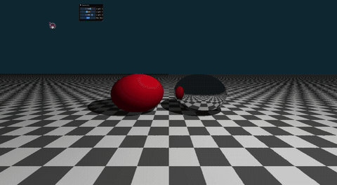

# 实验：Whitted-Style 迭代式光线追踪（Taichi GPU）本项目基于 Taichi GPU 并行框架实现经典 Whitted 风格光线追踪，采用迭代循环替代递归完成光线弹射，实现硬阴影、镜面反射全局光照效果；场景包含棋盘格地面、漫反射球体、镜面球体，配套可交互 UI 动态调节光源位置与光线最大弹射次数，区分光线投射与光线追踪渲染管线差异。
## 学号姓名专业
202411081073
吕铭浩
计算机科学与技术

## 运行效果

## 核心实现逻辑
1. 光线追踪基础理论
光线投射与光线追踪区别：光线投射仅计算摄像机主光线直接着色，无次级射线；光线追踪会额外发射暗影射线、反射次级射线，实现阴影、镜面反射全局光照效果。
Whitted 光线追踪模型：主光线击中物体后，依据材质分支发射次级射线：漫反射材质仅计算直接光照，镜面材质生成反射射线持续迭代追踪。
反射向量计算：基于反射定律求解光线反射方向，用于镜面弹射路径计算。
2. 三维隐式场景构建不依赖外部模型文件，通过数学方程定义三类几何体，并使用材质 ID 区分渲染属性：
无限棋盘格地面：平面固定于 \(y=-1.0\)，法线朝上，通过交点 \(X、Z\) 坐标奇偶性生成黑白棋盘纹理，漫反射材质；
红色漫反射球体：坐标 \((-1.2, 0, 0)\)，半径 1.0，仅参与直接光照计算，无反射；
银色镜面球体：坐标 \((1.2, 0, 0)\)，半径 1.0，纯镜面材质，持续生成反射次级射线。
3. 迭代式光线弹射（GPU 适配方案）GPU 不支持递归函数，使用循环迭代实现光线多次弹射，核心变量：
throughput：光线能量衰减系数，初始值 1.0，镜面反射时乘以反射率衰减光线能量；
final_color：累积最终像素颜色，初始为纯黑色；
迭代规则：

光线击中镜面物体：更新光线起点、反射方向，衰减光线能量，继续循环追踪；
光线击中漫反射物体：计算该点直接光照，叠加至最终颜色，终止光线追踪；
光线未击中任何物体：叠加背景色，结束循环。
4. 硬阴影实现与精度自相交修复
暗影射线逻辑：漫反射着色时，从交点向光源发射暗影射线，若射线中途与场景几何体相交，则该点处于阴影，仅保留环境光；
Shadow Acne 自相交 Bug 解决方案：所有次级射线（暗影射线、反射射线）起点沿表面法线向外偏移极小值 \(1e-4\)，避免射线与自身表面误相交产生黑色噪点。
5. 光照着色逻辑漫反射表面采用简化 Phong 模型，分为环境光与直接漫反射分量：
阴影区域仅保留基础环境光；
无遮挡区域叠加漫反射光照，形成明暗对比清晰的硬阴影效果。
6. 实时交互控制面板基于 Taichi GGUI 搭建参数调节面板，支持实时修改并刷新渲染画面：
Light X/Y/Z 滑动条：三维拖动点光源坐标，阴影同步移动；
Max Bounces 整数滑块：光线最大弹射次数，取值范围 1~5，默认 3；

弹射次数 = 1：无镜面反射，仅基础阴影渲染；
弹射次数 > 1：生成镜面反射，可观察镜中反射场景。

## UI 交互说明
右侧悬浮面板滑块：实时调整光源三维坐标、光线最大弹射次数；
关闭窗口 / ESC 按键：退出光线追踪渲染程序。
## 仓库链接
https://github.com/tybxt/zuoye5
